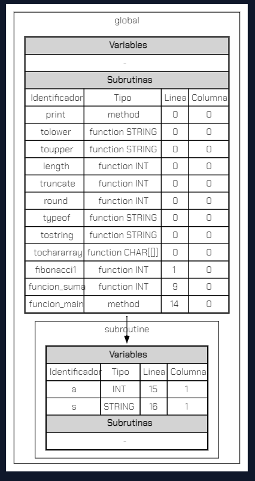

# **Proyecto 2**
### Universidad de San Carlos de Guatemala
### Facultad de Ingeniería
### Escuela de Ciencias y Sistemas
### Organización de Lenguajes y Compiladores 1
### Sección C
<br></br>

## **Manual Técnico**
<br></br>

| Nombre | Carnet | 
| --- | --- |
| Damián Ignacio Peña Afre | 202110568 |
----

## **Tabla de Contenido**
- [Descripción General](#descripción-general)


## **Descripción General**

Creación del interprete de programación `TypeWise`. Este lenguaje tendrá una sintaxis similar a Java o `Typescript`. El interprete será desarrollado en el lenguaje de programación `TypeScript`.

<br>
<br>
<br>

## **Descripción de la solución**

La aplicación web que se desarrolló con `React` y `Typescript` tiene como objetivo proporcionar una herramienta útil para los usuarios que deseen ejecutar scripts de `TypeWise`. Para ello, se implementó un editor de texto que permitirá introducir los scripts y ejecutarlos con solo hacer clic en un botón. Además, la aplicación cuenta con una consola integrada que muestra los resultados de la ejecución del script y una reportería de errores léxicos, sintácticos y semánticos.

La aplicación también ofrece una funcionalidad avanzada para la gestión de archivos, permitiendo a los usuarios abrir, renombrar y cerrar pestañas con facilidad. Esto hace que la aplicación sea más fácil de usar y permite a los usuarios mantener sus proyectos organizados y ordenados.

Los reportes generados por la aplicación, incluyendo la tabla de símbolos y el AST, se realizan utilizando la librería `Graphviz`. Además, el editor de texto se ha construido utilizando la librería Monaco Editor, que se utiliza en el popular entorno de desarrollo integrado (IDE) Visual Studio Code.

Cabe destacar que, a diferencia de otras aplicaciones, la lógica de esta aplicación se procesa completamente en el lado del cliente, lo que significa que no se requiere de un servidor para la ejecución del script. Para implementar la lógica del intérprete se utilizó la herramienta `Jison`, que es un generador de analizadores léxicos y sintácticos.

<br>
<br>
<br>

## **Estructura del interpréte**


<br>
<br>
<br>

## **Estructura de herencia de los nodos del AST**


<br>
<br>
<br>

## **Analísis Léxico**

Para el análisis léxico se utilizó la herramienta `Jison`, que es un generador de analizadores léxicos y sintácticos. Para ello, se creó un archivo llamado `lexer.jison` que contiene la definición de los tokens que se utilizarán en el lenguaje `TypeWise`, los tokens, así como sus respectivas expresiones regulares se muestran a continuación:

### Comentarios

* `"//".*`    -> SINGLE LINE COMMENT <br>
* `[/][*][^*]*[*]+([^/*][^*]*[*]+)*[/]`  -> MULTI LINE COMMENT <br>


### Identificadores
`([a-zA-ZÑñ]|("_"[a-zA-ZÑñ]))([a-zA-ZÑñ]|[0-9]|"_")*` -> ID

### Literales
* `\'([^\r\n'\\]|\\[btnfr"'\\]|\\[0-9a-fA-F]{2}|\\u[0-9a-fA-F]{4})\' `-> CHAR_LITERAL <br>
* `/^"(\\.|[^"\\])*"$/                                               `-> STRING_LITERAL <br>
* `[0-9]+                                                            `-> INT_LITERAL <br>
* `[0-9]+[.][0-9]+                                                   `-> DOUBLE_LITERAL <br>

### Tipos

* `"int"`     -> INT <br>
* `"double"`  -> DOUBLE <br>
* `"string"`  -> STRING <br>
* `"boolean"` -> BOOLEAN <br>
* `"char"`    -> CHAR <br>

### Operadores

#### Operadores aritméticos

* `"+"` -> PLUS <br>
* `"-"` -> MINUS <br>
* `"*"` -> TIMES <br>
* `"/"` -> DIVIDE <br>
* `"^"` -> POWER <br>
* `"%"` -> MOD <br>

#### Operadores relacionales

* `"=="` -> EQUALS <br>
* `"!="` -> NOT_EQUAL <br>
* `"<"`  -> LESS_THAN <br>
* `"<="` -> LESS_THAN_OR_EQUAL <br>
* `">"`  -> GREATER_THAN <br>
* `">="` -> GREATER_THAN_OR_EQUAL <br>

#### Operador ternario

* `"?"` -> INTERROGATION <br>
* `":"` -> COLON <br>

#### Operators lógicos

`* `"&&"` -> AND <br>
`* `"\|\|"` -> OR <br>
`* `"!"` -> NOT <br>

#### Operators de agrupación

`"("` -> LPAREN <br>
`")"` -> RPAREN <br>

#### Fin de sentencia

`";"` -> SEMICOLON <br>

#### Operador de asignación

`"="` -> EQUAL <br>

#### Operadores para incrementar o decrementar

`"++"` -> PLUS_PLUS <br>
`"--"` -> MINUS_MINUS <br>

#### Corchetes y llaves

`"["` -> LBRACKET <br>
`"]"` -> RBRACKET <br>
`"{"` -> LBRACE <br>
`"}"` -> RBRACE <br>

#### Palabras reservadas

`"if"` -> IF <br>
`"else"` -> ELSE <br>
`"switch"` -> SWITCH <br>
`"case"` -> CASE <br>
`"default"` -> DEFAULT <br>
`"while"` -> WHILE <br>
`"for"` -> FOR <br>
`"do"` -> DO <br>
`"void"` -> VOID <br>
`"true"` -> TRUE <br>
`"false"` -> FALSE <br>

#### Sentencias de control

`"break"` -> BREAK <br>
`"continue"` -> CONTINUE <br>
`"return"` -> RETURN <br>

#### Otros tokens

`","` -> COMMA <br>
`"."` -> DOT <br>

<br>
<br>
<br>

## **Precedencia de operadores**

La precedencia de los operadores logra que las expresiones se evalúen en el orden correcto. La siguiente lista va en orden de mayor a menor precedencia:


1. Unary Not `[-]` Asociativo por la derecha
1. Increment `[++]` Asociativo por la derecha
1. Decrement `[--]` Asociativo por la derecha
2. Parentheses `[ ( ) ]` Asociativo por la izquierda
3. Power `[^]` No es asociativo
4. Multiplication `[*]` Asociativo por la izquierda
4. Division `[/]` Asociativo por la izquierda
4. Modulus `[%]` Asociativo por la izquierda
5. Addition `[+]` Asociativo por la izquierda
5. Subtraction `[-]` Asociativo por la izquierda
6. Relational Operators `[==, !=, <, <=, >, >=]` Asociativo por la izquierda
7. Not `[!]` Asociativo por la derecha
8. And `[&&]` Asociativo por la izquierda
8. Or `[||]` Asociativo por la izquierda
9. Ternary `[?:]` Asociativo por la izquierda


<br>
<br>
<br>

## **Análisis sintáctico**

El proceso de análisis sintáctico con Jison comienza con la definición de las reglas gramaticales del lenguaje de programación que se desea analizar. Estas reglas definen la estructura sintáctica del lenguaje, es decir, cómo se combinan las diferentes expresiones y declaraciones para formar programas válidos.

Una vez que se han definido las reglas gramaticales, Jison genera automáticamente un analizador sintáctico que puede ser utilizado para analizar el código fuente de un programa escrito en el lenguaje de programación definido. El analizador sintáctico recibe el código fuente como entrada y lo convierte en un árbol de sintaxis abstracta (AST), que es una representación estructurada del programa en términos de sus elementos sintácticos.

El árbol de sintaxis abstracta es una estructura de datos jerárquica que representa la estructura del programa en términos de sus componentes sintácticos básicos, como variables, operadores y expresiones. Esta estructura de datos puede ser utilizada para realizar análisis adicionales del programa, como la verificación de tipos y la optimización del código.

A continuación se muestra la gramática del lenguaje de programación que se desea analizar:


- Program start
```
Program    -> Statements EOF
            |  EOF
``` 

- Statements
```
Statements -> NormalStatement FlowControl
            |  NormalStatement
            |  FlowControl 
```

- Normal Statements
```
NormalStatement -> NormalStatement Statement
                 | Statement
```

- Flow Control statements
```
FlowControl -> BREAK SEMICOLON
             | CONTINUE SEMICOLON
             | RETURN SEMICOLON
             | RETURN Expression SEMICOLON
```

- Posible statements
```
Statement -> Declaration
           | Assignment
           | If
           | Switch
           | While
           | For
           | Do
           | SubroutineCall
           | SubroutineDeclaration
```
          
- Types
```
Type -> INT
      | DOUBLE
      | STRING
      | BOOLEAN
      | CHAR
```

- Variable declaration
```
Declaration -> Type ID SEMICOLON
             | Type ID EQUAL Expression SEMICOLON
```

- Variable assignment
```
Assignment -> ID EQUAL Expression SEMICOLON
            | ID PLUS_PLUS SEMICOLON
            | ID MINUS_MINUS SEMICOLON
```

- If statement
```
If -> IF LPAREN Expression RPAREN LBRACE Statements RBRACE
    | IF LPAREN Expression RPAREN LBRACE Statements RBRACE IfChain
```

- If chain (else, else if)
```
IfChain -> ELSE LBRACE Statements RBRACE
         | ELSE IF LPAREN Expression RPAREN LBRACE Statements RBRACE IfChain
```

- Switch statement
```
Switch -> SWITCH LPAREN Expression RPAREN LBRACE Cases RBRACE
```

- Switch body
```
Cases -> CasesList 
       | CasesList Default
```

- Cases list
```
CasesList -> CasesList Case
           | Case
```

- Case
```
Case -> CASE Expression COLON Statements
```

- While statement
```
While -> WHILE LPAREN Expression RPAREN LBRACE Statements RBRACE
```

- For statement
```
For -> FOR LPAREN ForInit SEMICOLON ForCondition SEMICOLON ForUpdate RPAREN LBRACE Statements RBRACE
```

- For, init statement
```
ForInit -> Declaration
         | Assignment
         | SubroutineCall ???
```

- For condition statement
```
ForCondition -> Expression
```

- For update statement
```
ForUpdate -> Assignment
```

- DoWhile statement
```
Do -> DO LBRACE Statements RBRACE WHILE LPAREN Expression RPAREN SEMICOLON
```

- Subroutine call
```
SubroutineCall -> ID LPAREN RPAREN SEMICOLON
                | ID LPAREN Arguments RPAREN SEMICOLON
```

- Object subroutine call
```
ObjectSubroutineCall -> ID DOT SubroutineCall // !!!
```

- Arguments of subroutine call
```
Arguments -> Expression
           | Arguments COMMA Expression
```


- Subroutine declaration
```
SubroutineDeclaration -> MethodDeclaration
                       | FunctionDeclaration
```

- Method declaration
```
MethodDeclaration -> VOID ID LPAREN RPAREN LBRACE Statements RBRACE
                   | VOID ID LPAREN SubroutineArguments RPAREN LBRACE Statements RBRACE
```

- Function declaration
```
FunctionDeclaration -> Type ID LPAREN RPAREN LBRACE Statements RBRACE
                     | Type ID LPAREN SubroutineArguments RPAREN LBRACE Statements RBRACE
```

- Arguments of subroutine declaration
```
SubroutineArguments -> Type ID
                     | FunctionArguments COMMA Type ID
```

- Expression
```
Expression -> Expression PLUS Expression
            | Expression MINUS Expression
            | Expression TIMES Expression
            | Expression DIVIDE Expression
            | Expression POWER Expression
            | Expression MOD Expression
            | MINUS Expression               PREC: UNARY_OPERATOR
            | LPAREN Expression RPAREN
            | Expression EQUALS Expression
            | Expression NOT_EQUAL Expression
            | Expression LESS_THAN Expression
            | Expression LESS_THAN_OR_EQUAL Expression
            | Expression GREATER_THAN Expression
            | Expression GREATER_THAN_OR_EQUAL Expression
            | Expression AND Expression
            | Expression OR Expression
            | NOT Expression
            | Expression INTERROGATION Expression COLON Expression PREC: TERNARY_OPERATOR
            | ID
            | INT_LITERAL
            | DOUBLE_LITERAL
            | STRING_LITERAL
            | CHAR_LITERAL
            | TRUE
            | FALSE
            | ID PLUS_PLUS
            | ID MINUS_MINUS
```

Algunas de estas producciones gramáticales producirán nodos AST con la información necesaria para la ejecución del script.
<br>
<br>
<br>

## **Análisis semántico**

Ya que se hayan identificado todos los componentes o elementos sintácticos del lenguaje, se principia haciendo un recorrido del AST para buscar la declaración de funciones, o declaraciones en el scope Global.

Una vez se han hecho esta "pasada", se localizará la función `main` que hará la llamada a alguna función o método, y se procederá a hacer un recorrido del AST para buscar la declaración de funciones, o declaraciones en el scope Global.

Este proceso se realizará de forma iterativa, ejecutando las instrucciones dentro del cuerpo de la o las funciones, y se irán guardando los valores de las variables en un scope local, para que cuando se haga un llamado a una función, se pueda acceder a las variables declaradas en el scope global.
<br>
<br>
<br>

## **Manejo de errores**

Durante las etapas de analisis léxico y sintáctico se pueden añadir errores a la tabla de errores.

Si no llegara a satisfacerse una regla léxica se añadiría como un error léxico.

Por otro lado, si no llegara a satisfacerse una regla gramatical se añadiría como un error sintáctico.

Por último, si mientras la generación se llegara a producir alguna excepción en la definición de algun elemento, en su referencia o en su tipo son añadidos como errores en tiempo de ejecución a la tabla de errores.
<br>
<br>
<br>

## **Consideraciones del lenguaje**


Se definen cuatro tipos de datos, los cuales son Entero, Doble, Booleano y Caracter, junto con sus definiciones, descripciones, ejemplos y observaciones. Además, se incluye otro tipo de dato llamado Cadena, que es un conjunto de caracteres delimitados por comillas dobles, con la posibilidad de incluir secuencias de escape como salto de línea y tabulación. Este conocimiento es esencial para la creación de variables y el manejo de datos en el lenguaje.

<br>
<br>
<br>


## **Estructuras de datos relevantes**

### Scope Trace

El scope trace es una estructura arborea, cuya raiz o primer nodo es el scope global, y cada vez que se crea un nuevo scope, se añade como hijo del scope actual, ya sea local o global.

Esta estructura se utiliza para almacenar los scopes locales y globales, y para poder acceder a los valores, sean variables o subrutinas declaradas.

Un scope local puede acceder a todos los scopes que esten por arriba del en jeraquía, siempre que sea un padre directo.

Podría verse a esta estructura como la tabla de símbolos, pero con la diferencia de que se puede acceder a los scopes locales, y no solo al global.

A continuación se muestra la implementación de esta estructura:

```typescript

import { GlobalScope, Scope, LocalScopeType, LocalScope } from "."
import { Subroutine, Variable } from "../../elements"
import { graphviz } from 'd3-graphviz';

export type NewScopeRequest = {
    reason: LocalScopeType
}

export class ScopeTrace {

    public globalScope: GlobalScope
    public currentScope: Scope
    private scopeCounter: number

    constructor() {
        this.globalScope = new GlobalScope()
        this.currentScope = this.globalScope
        this.scopeCounter = 1;
    }

    public newScope({ reason }: NewScopeRequest) {
        if (this.currentScope instanceof GlobalScope) {
            const newScope = new LocalScope(reason, this.globalScope, this.scopeCounter++)
            this.globalScope.addLocal(newScope)
            this.currentScope = newScope
            return newScope
        } else if (this.currentScope instanceof LocalScope) {
            const newScope = new LocalScope(reason, this.currentScope, this.scopeCounter++)
            this.currentScope.addScope(newScope)
            this.currentScope = newScope
            return newScope
        } else {
            throw new Error("Unexpected scope type")
        }
    }

    public endScope() {
        if (this.currentScope instanceof GlobalScope) {
            throw new Error("Cannot end global scope")
        } else if (this.currentScope instanceof LocalScope) {
            this.currentScope = this.currentScope.previous
        } else {
            throw new Error("Unexpected scope type")
        }
    }

    public resetScope() {
        this.currentScope = this.globalScope
    }

    public setCurrentScope(scope: Scope) {
        this.currentScope = scope
    }

    getVariable(name: string): Variable | null {
        return this.currentScope.getVariable(name)
    }
    getSubroutine(name: string): Subroutine | null {
        return this.currentScope.getSubroutine(name)
    }
    variableExists(name: string): boolean {
        return this.currentScope.variableExists(name)
    }
    subroutineExists(name: string): boolean {
        return this.currentScope.subroutineExists(name)
    }

    addVariable(variable: Variable) {
        this.currentScope.addVariable(variable)
    }

    addSubroutine(subroutine: Subroutine) {
        this.currentScope.addSubroutine(subroutine)
    }

    get graphviz() {
        return `
            digraph G {

            node [shape=none];
            rankdir=TB;
            
            ${this.globalScope.graphviz()}

            }
        `
    }
}
```

Este código es una implementación de una clase llamada ScopeTrace, que es utilizada para mantener un registro de los ámbitos (también conocidos como scopes) en un programa. La clase ScopeTrace tiene varias propiedades y métodos que se describen a continuación:

GlobalScope y Scope son dos clases importadas del mismo módulo (archivo) en el que se encuentra ScopeTrace. La clase LocalScopeType es una enumeración que describe el tipo de ámbito (local o global). La clase LocalScope representa un ámbito local y tiene como argumentos un reason que es la razón por la que se crea el ámbito, una referencia al ámbito anterior y un contador de ámbitos. La clase Subroutine representa una subrutina o función y la clase Variable representa una variable en el programa.

graphviz es una función importada del paquete d3-graphviz que se utiliza para generar un diagrama del árbol de ámbitos.

NewScopeRequest es un tipo de objeto que tiene una propiedad reason que es un LocalScopeType.

public globalScope, public currentScope y private scopeCounter son propiedades de la clase. globalScope es una instancia de la clase GlobalScope que representa el ámbito global del programa. currentScope es una referencia al ámbito actual y se inicia en el ámbito global. scopeCounter es un número que se utiliza para mantener un registro del número de ámbitos locales que se han creado.

El constructor de la clase ScopeTrace crea una instancia de la clase GlobalScope y establece globalScope y currentScope en esta instancia. scopeCounter se establece en 1.

El método newScope crea un nuevo ámbito y lo establece como el ámbito actual. El argumento reason se utiliza para indicar la razón por la que se crea el ámbito. Si currentScope es una instancia de GlobalScope, se crea un nuevo ámbito local y se establece como el ámbito actual y se agrega a globalScope. Si currentScope es una instancia de LocalScope, se crea un nuevo ámbito local y se agrega como un subámbito de currentScope y se establece como el ámbito actual. Si currentScope no es una instancia de GlobalScope o LocalScope, se lanza un error.

El método endScope finaliza el ámbito actual. Si currentScope es una instancia de GlobalScope, se lanza un error. Si currentScope es una instancia de LocalScope, currentScope se establece en el ámbito anterior.

El método resetScope establece currentScope en globalScope.

El método setCurrentScope establece currentScope en un ámbito específico.

Los métodos getVariable, getSubroutine, variableExists y subroutineExists se utilizan para obtener información sobre las variables y subrutinas en el ámbito actual. Estos métodos llaman a los métodos correspondientes en el ámbito actual.

Los métodos addVariable y addSubroutine se utilizan para agregar una variable o subrutina al ámbito actual.

La propiedad graphviz devuelve una cadena que representa un diagram


Aprovechando, la reportería del propio sistema, se ejemplifica la forma de esta estructura:



<br>
<br>
<br>

### Call Stack

El call stack es una estructura de datos que se utiliza para almacenar las llamadas a subrutinas que se han realizado en el programa. Esta estructura se utiliza para almacenar las llamadas a subrutinas y para poder acceder a los valores de retorno de las subrutinas.

Así mismo, se aprovecha para apilar sentencias ciclicas, como los bucles, para poder realizar saltos a la sentencia de inicio del bucle con las estructuras de control break y continue.

Se presenta a continuación la implementación de esta estructura:

```typescript

import { TypeWiseValueType } from "../../elements";


export interface Breakable {
    break: boolean;
}

export interface Continueable {
    continue: boolean;
}

export interface Returnable {
    return: boolean;
    returnValue: any;
    returnValueType: TypeWiseValueType;
}

type CallStackItem = Breakable | Continueable | Returnable;

export class CallStack {
    private stack: Array<CallStackItem> = [];

    public push(item: CallStackItem) {
        this.stack.push(item);
    }

    public pop(): CallStackItem | null {
        if (this.isEmpty()) return null;
        return this.stack.pop() as CallStackItem;
    }

    public peek(): CallStackItem | null {
        if (this.isEmpty()) return null;
        return this.stack[this.stack.length - 1];
    }

    public in(item: CallStackItem): boolean {
        return this.stack.includes(item);
    }

    public isEmpty(): boolean {
        return this.stack.length === 0;
    }

    public remove(item: CallStackItem) {
        const index = this.stack.indexOf(item);
        if (index > -1) this.stack.splice(index, 1);
    }


}
```

El código define una clase CallStack que implementa una estructura de pila para almacenar y manipular objetos de tipo CallStackItem. CallStackItem es una unión de tres interfaces diferentes: Breakable, Continueable, y Returnable.

Breakable define un solo campo booleano break, Continueable define un campo booleano continue, mientras que Returnable define dos campos: return, que es un booleano y returnValue, que puede contener cualquier valor y returnValueType que es una instancia de la clase TypeWiseValueType.

La clase CallStack tiene un miembro privado stack que es un array de CallStackItem.

La clase CallStack tiene varios métodos para manipular la pila. El método push agrega un elemento al final de la pila. El método pop elimina el último elemento agregado a la pila y lo devuelve. El método peek devuelve el último elemento agregado a la pila sin eliminarlo. El método in devuelve un booleano que indica si el objeto pasado como parámetro está presente en la pila. El método isEmpty devuelve true si la pila está vacía. El método remove elimina el objeto especificado de la pila.

En resumen, la clase CallStack proporciona una implementación de una estructura de pila para almacenar y manipular objetos que pueden ser Breakable, Continueable, o Returnable.

<br>
<br>
<br>

## **Interfaz gráfica**

Para apoyarse y facilitar la implementación de la interfaz gráfica, se utilizó la librería React, la cual es una librería de JavaScript para construir interfaces de usuario. En conjunto con las siguientes librerías:

* `"@headlessui/react"`: Esta biblioteca proporciona componentes de interfaz de usuario reutilizables y personalizables sin estilos predeterminados. Se puede utilizar para construir componentes de interfaz de usuario como menús desplegables, modales y diálogos.

* `"@monaco-editor/react"`: Es un editor de código de alto rendimiento que se utiliza para crear y editar código en una aplicación web. Es altamente personalizable y compatible con una variedad de lenguajes de programación.

* `"d3-graphviz"`: Esta biblioteca proporciona herramientas para visualizar gráficos en la web utilizando la sintaxis de Graphviz.

* `"graphviz-react"`: Es un componente React para renderizar gráficos utilizando Graphviz.

* `"react-hot-toast"`: Esta biblioteca proporciona una forma fácil de mostrar notificaciones en la aplicación web.

* `"react-icons"`: Proporciona una colección de iconos SVG de alta calidad para utilizar en la interfaz de usuario.

