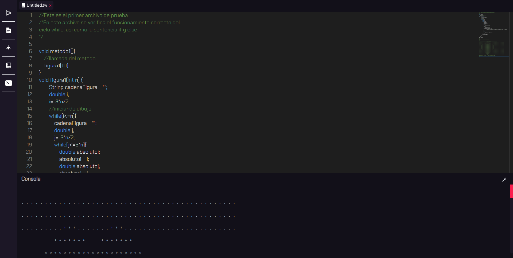
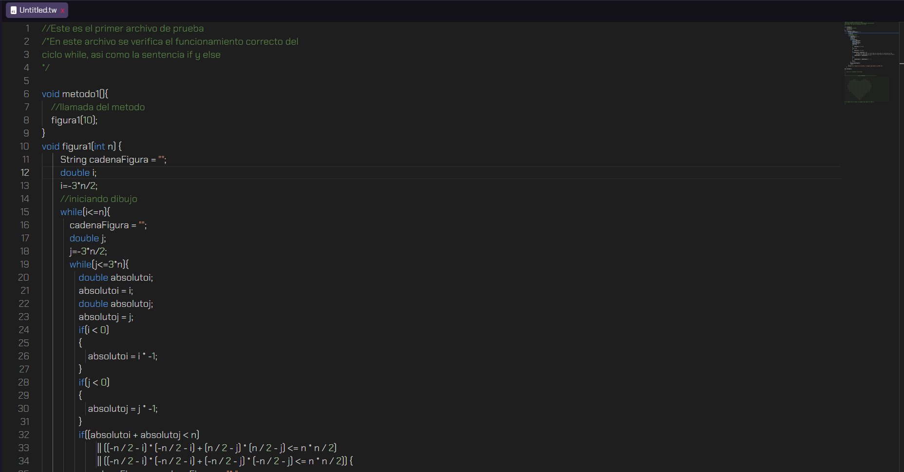
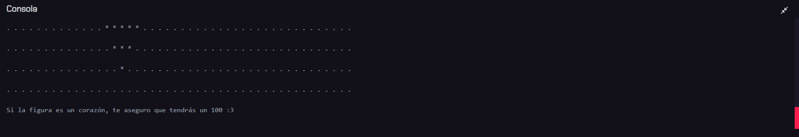
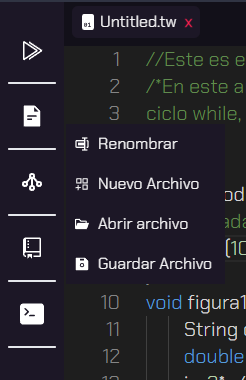
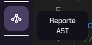
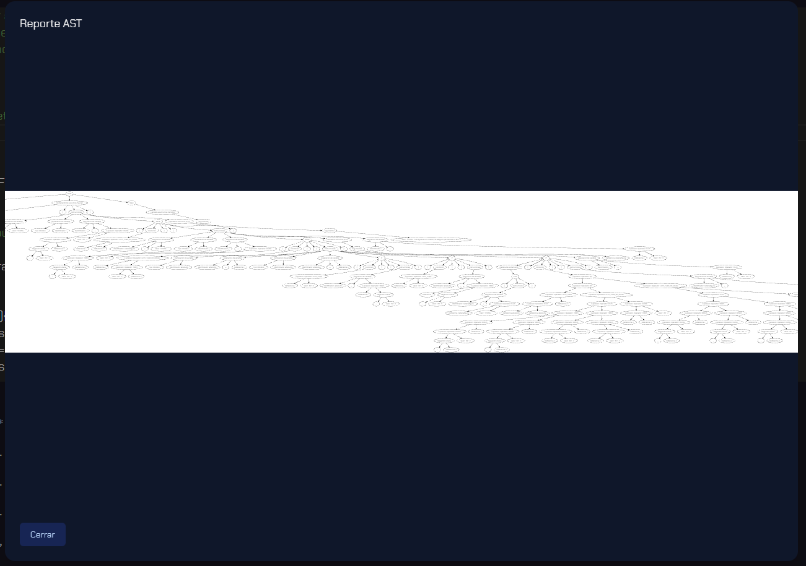
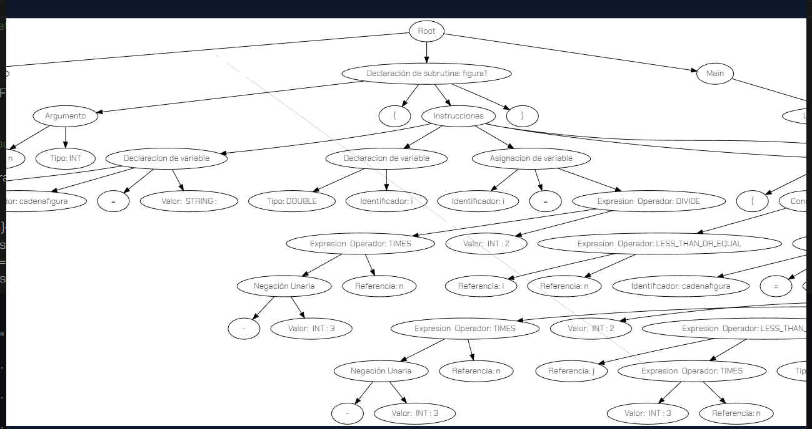
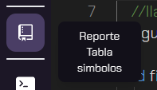
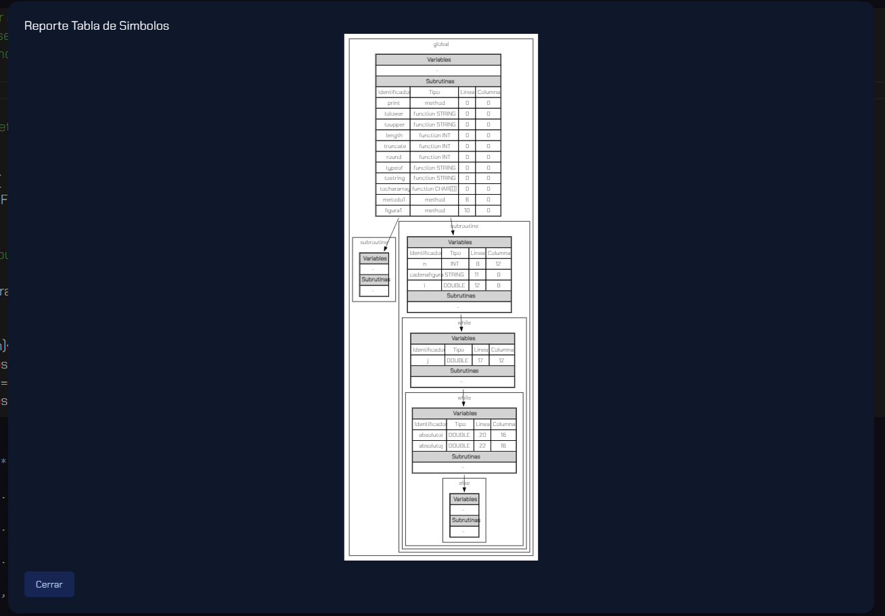
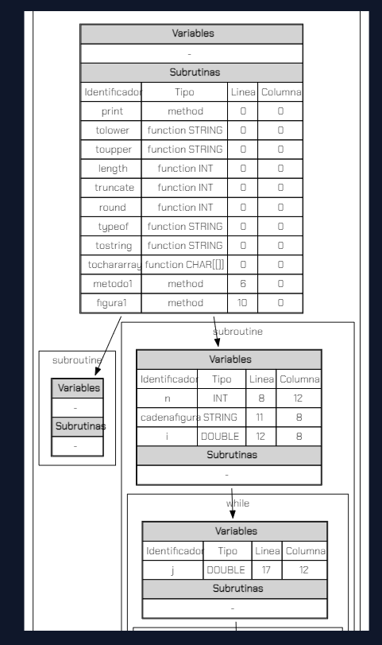

# **Proyecto 2**
### Universidad de San Carlos de Guatemala
### Facultad de Ingeniería
### Escuela de Ciencias y Sistemas
### Organización de Lenguajes y Compiladores 1
### Sección C
<br></br>

## **Manual de Usuario**
<br></br>

| Nombre | Carnet | 
| --- | --- |
| Damián Ignacio Peña Afre | 202110568 |
----

## **Tabla de Contenido**

- [Interfaz gráfica](#interfaz-gráfica)
- [Editor de texto](#editor-de-texto)
- [Consola](#consola)
- [Barra de herramientas](#barra-de-herramientas)
- [Reportes](#reportes)
  - [Reporte AST](#reporte-ast)
  - [Reporte tabla de símbolos](#reporte-tabla-de-símbolos)
- [Especificación del lenguaje](#especificación-del-lenguaje)
    - [Tipos de datos](#tipos-de-datos)
    - [Variables](#variables)
    - [Asignación](#asignación)
    - [Operadores aritméticos](#operadores-aritméticos)
    - [Operadores relacionales](#operadores-relacionales)
    - [Operadores lógicos](#operadores-lógicos)
    - [Estructuras de control](#estructuras-de-control)
        - [If](#if)
        - [If-else](#if-else)
        - [If-else if-else](#if-else-if-else)
        - [Switch](#switch)
        - [While](#while)
        - [Do-while](#do-while)
        - [For](#for)
    - [Funciones](#funciones)
    - [Métodos](#métodos)
    - [Comentarios](#comentarios)
        - [Comentarios de una línea](#comentarios-de-una-línea)
        - [Comentarios de múltiples líneas](#comentarios-de-múltiples-líneas)
    - [Funcione nativas](#funcione-nativas)
    - [Errores](#errores)
        - [Error léxico](#error-léxico)
        - [Error sintáctico](#error-sintáctico)
        - [Error semántico](#error-semántico)
<br>


## **Descripción General**


La aplicación web que se desarrolló con `React` y `Typescript` tiene como objetivo proporcionar una herramienta útil para los usuarios que deseen ejecutar scripts de `TypeWise`. Para ello, se implementó un editor de texto que permitirá introducir los scripts y ejecutarlos con solo hacer clic en un botón. Además, la aplicación cuenta con una consola integrada que muestra los resultados de la ejecución del script y una reportería de errores léxicos, sintácticos y semánticos.

La aplicación también ofrece una funcionalidad avanzada para la gestión de archivos, permitiendo a los usuarios abrir, renombrar y cerrar pestañas con facilidad. Esto hace que la aplicación sea más fácil de usar y permite a los usuarios mantener sus proyectos organizados y ordenados.

Los reportes generados por la aplicación, incluyendo la tabla de símbolos y el AST, se realizan utilizando la librería `Graphviz`. Además, el editor de texto se ha construido utilizando la librería Monaco Editor, que se utiliza en el popular entorno de desarrollo integrado (IDE) Visual Studio Code.

Cabe destacar que, a diferencia de otras aplicaciones, la lógica de esta aplicación se procesa completamente en el lado del cliente, lo que significa que no se requiere de un servidor para la ejecución del script. Para implementar la lógica del intérprete se utilizó la herramienta `Jison`, que es un generador de analizadores léxicos y sintácticos.

<br>
<br>
<br>

## **Interfaz gráfica**

La interfaz gráfica de la aplicación se muestra a continuación:



La interfaz gráfica se divide en tres secciones principales: el editor de texto, la consola y la barra de herramientas. A continuación, se describen las funcionalidades de cada una de estas secciones.

<br>

### **Editor de texto**

El editor de texto es la sección principal de la aplicación. En esta sección, los usuarios pueden escribir sus scripts de `TypeWise` y ejecutarlos con solo hacer clic en el botón de ejecución. Además, los usuarios pueden abrir, renombrar y cerrar pestañas con facilidad. Esto hace que la aplicación sea más fácil de usar y permite a los usuarios mantener sus proyectos organizados y ordenados.



<br>


### **Consola**

La consola es la sección donde se muestran los resultados de la ejecución del script. En esta sección, los usuarios pueden ver los mensajes de salida y los errores léxicos, sintácticos y semánticos que se generan durante la ejecución del script.



<br>


### **Barra de herramientas**

La barra de herramientas es la sección donde se encuentran los botones para ejecutar el script, abrir un archivo, renombrar una pestaña y cerrar una pestaña, así como la generación de reportes.



<br>

### **Reportes**

### Reporte AST

El reporte AST muestra el árbol de sintaxis abstracta generado durante la ejecución del script, se detallan los nodos y las relaciones entre ellos. Para generar el reporte, se debe hacer clic en el botón `AST` de la barra de herramientas.



<br>
<br>



<br>
<br>



<br>

### Reporte tabla de símbolos

El reporte de la tabla de símbolos muestra la información de los símbolos que se encuentran en el script. Para generar el reporte, se debe hacer clic en el botón `Tabla de símbolos` de la barra de herramientas.



<br>
<br>



<br>
<br>



## **Especificación del lenguaje**

### **Tipos de datos**

El lenguaje `TypeWise` soporta los siguientes tipos de datos:

- `int`: representa un número entero.	
- `double`: representa un número de punto flotante.
- `string`: representa una cadena de caracteres.
- `bool`: representa un valor booleano.
- `char`: representa un caracter.

### **Variables**

Las variables se declaran utilizando el tipo de dato y el identificador de la variable. Por ejemplo:

```
int x;
double y;
string z;
bool w;
```

### **Asignación**

La asignación se realiza utilizando el operador `=`. Por ejemplo:

```
x = 10;
y = 10.5;
z = "Hello World";
w = true;
```

### **Operadores aritméticos**

El lenguaje `TypeWise` soporta los siguientes operadores aritméticos:

- `+`: suma dos valores.
- `-`: resta dos valores.
- `*`: multiplica dos valores.
- `/`: divide dos valores.
- `%`: obtiene el residuo de la división de dos valores.
- `^`: eleva un valor a la potencia de otro valor.

### **Operadores relacionales**

El lenguaje `TypeWise` soporta los siguientes operadores relacionales:

- `==`: verifica si dos valores son iguales.
- `!=`: verifica si dos valores son diferentes.
- `>`: verifica si el primer valor es mayor que el segundo.
- `<`: verifica si el primer valor es menor que el segundo.
- `>=`: verifica si el primer valor es mayor o igual que el segundo.
- `<=`: verifica si el primer valor es menor o igual que el segundo.

### **Operadores lógicos**

El lenguaje `TypeWise` soporta los siguientes operadores lógicos:

- `&&`: verifica si dos valores son verdaderos.
- `||`: verifica si al menos uno de los dos valores es verdadero.
- `!`: verifica si un valor es falso.

### **Estructuras de control**

El lenguaje `TypeWise` soporta las siguientes estructuras de control:

#### **If**

La estructura `if` permite ejecutar un bloque de código si se cumple una condición. Por ejemplo:

```
if (x > 10) {
    print("x es mayor que 10");
}
```

#### **If-else**

La estructura `if-else` permite ejecutar un bloque de código si se cumple una condición y otro bloque de código si no se cumple la condición. Por ejemplo:

```

if (x > 10) {
    print("x es mayor que 10");
} else {
    print("x es menor o igual que 10");
}
```

#### **If-else if-else**

La estructura `if-else if-else` permite ejecutar un bloque de código si se cumple una condición, otro bloque de código si se cumple otra condición y otro bloque de código si no se cumple ninguna de las condiciones. Por ejemplo:

```

if (x > 10) {
    print("x es mayor que 10");
} else if (x < 10) {
    print("x es menor que 10");
} else {
    print("x es igual a 10");
}
```

#### **Switch**

La estructura `switch` permite ejecutar un bloque de código si se cumple una condición. Por ejemplo:

```
switch (x) {
    case 1:
        print("x es igual a 1");
        break;
    case 2:
        print("x es igual a 2");
        break;
    default:
        print("x es diferente de 1 y 2");
        break;
}
```

#### **While**

La estructura `while` permite ejecutar un bloque de código mientras se cumpla una condición. Por ejemplo:

```
while (x < 10) {
    print("x es menor que 10");
    x = x + 1;
}
```

#### **Do-while**

La estructura `do-while` permite ejecutar un bloque de código mientras se cumpla una condición. Por ejemplo:

```
do {
    print("x es menor que 10");
    x = x + 1;
} while (x < 10);
```

#### **For**

La estructura `for` permite ejecutar un bloque de código mientras se cumpla una condición. Por ejemplo:

```
for (int i = 0; i < 10; i = i + 1) {
    print("i es menor que 10");
}
```

### **Funciones**

Las funciones son una clase de subrutinas que devuelven un valor. Para su declaración se indica el tipo de dato que devuelve la función, el identificador de la función y los parámetros que recibe la función. Por ejemplo:

```
int sum(int a, int b) {
    return a + b;
}
```

Para llamar a una función o método se debe indicar el identificador de la función o método y los parámetros que recibe la función o método. Por ejemplo:

```
int x = sum(10, 20);
```


### **Métodos**

Los métodos son una clase de subrutinas que no devuelven un valor. Para su declaración se indica el identificador del método y los parámetros que recibe el método. Por ejemplo:

```
void hola(string message) {
    print(message);
}
```

Para llamar a una función o método se debe indicar el identificador de la función o método y los parámetros que recibe la función o método. Por ejemplo:

```
int x = sum(10, 20);
hola("Hello World");
```

### **Comentarios**

Los comentarios son texto que no se toma en cuenta al momento de compilar el código. Los comentarios se pueden utilizar para documentar el código. El lenguaje `TypeWise` soporta los siguientes tipos de comentarios:

#### **Comentarios de una línea**

Los comentarios de una línea se indican con `//`. Por ejemplo:

```
// Este es un comentario de una línea
```

#### **Comentarios de múltiples líneas**

Los comentarios de múltiples líneas se indican con `/*` y `*/`. Por ejemplo:

```
/*
Este es un comentario
de múltiples líneas
*/
```

### **Funcione nativas**


* `toCharArray`: convierte una cadena de texto en un arreglo de caracteres.
* `toString`: convierte un valor en una cadena de texto.
* `typeof`: devuelve el tipo de dato de un valor.
* `round`: redondea un valor.
* `truncate`: trunca un valor.
* `length`: devuelve la longitud de un valor.
* `toUpper`: convierte una cadena de texto en mayúsculas.
* `toLower`: convierte una cadena de texto en minúsculas.
* `print`: imprime un valor en la consola.

## **Errores**

El lenguaje `TypeWise` destaca los siguientes tipos de errores:

### **Error léxico**

Los errores léxicos son errores que se producen cuando se escribe un caracter que no pertenece al lenguaje. Por ejemplo:

```
° // Caracter no válido
```

### **Error sintáctico**

Los errores sintácticos son errores que se producen cuando se escribe una instrucción que no pertenece al lenguaje. Por ejemplo:

```
int x = if (10 > 5) {
    print("10 es mayor que 5");
}
```

### **Error semántico**

Los errores semánticos son errores que se producen cuando se escribe una instrucción que no tiene sentido. Por ejemplo:

```
int x = 10 + "10";
```
